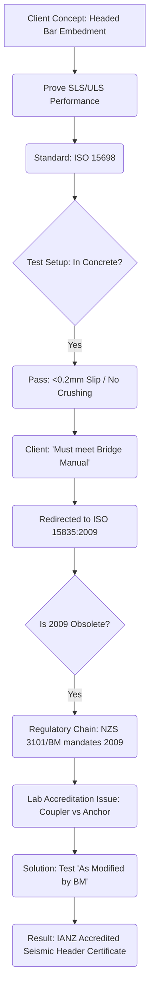
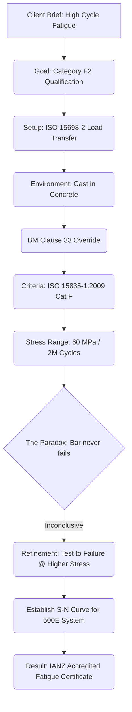

---

## Flow 1: Low Cycle Seismic Performance (Anchorage Development)

This flow maps the path for a client seeking to prove a headed bar combination meets the seismic and embedment requirements of the **NZTA Bridge Manual** and **NZS 3101**.

### 1.1 Process Narrative
1.  **Initial Client Brief**: Prove the combination meets Specific Level of Performance for SLS and ULS loadings (primarily end-of-bar embedment development).
2.  **Lab Recommendation**: Proposes **ISO 15698** (Headed Bar standard).
    *   *Method*: In-concrete Load Transfer.
    *   *Pass Criteria*: Slip $\le 0.2$ mm, no concrete crushing.
3.  **Bridge Manual Constraint**: Client requires Bridge Manual (BM) compliance.
    *   *Direct Result*: Shift to **ISO 15835:2009** (Coupler standard).
    *   *Conflict*: 2009 is technically obsolete (replaced by 2018), but it is the version anchored in the NZS 3101/BM regulatory chain.
4.  **Accreditation Paradox**: Labs are accredited for "Couplers" (ISO 15835), but this is an "Anchor".
    *   *Resolution*: Test "as modified by the Bridge Manual". Map the header physical test (in-concrete) to the coupler seismic criteria (slip/strength).

### 1.2 Flow Diagram: Low Cycle / Seismic

---

## Flow 2: High Cycle Fatigue Performance

This flow tracks the "optional" but often required high-cycle fatigue qualification for bridge components.

### 2.1 Process Narrative
1.  **Requirement**: Proving anchorage capacity under high-cycle elastic fatigue (Category F2).
2.  **The ISO 15698 Dilemma**: "Let's use 15698... Oh crap, that test is impossible."
    *   *Why?*: ISO 15698-2 (cl 5.8) mandates the load transfer test in a concrete prism. Setting up 10+ million cycles (requested for F2/F1) in a decaying concrete matrix is notoriously difficult to maintain.
3.  **The Bridge Manual Pivot**: "What about the BM?"
    *   *Answer*: The BM cl. 33 redirects to **ISO 15835 (Coupler)** stress ranges/cycles.
    *   *The Conflict*: ISO 15835 allows testing "in air" (tension-only), but the BM still categorizes these as "Anchors" (anchorage load transfer).
4.  **In Concrete or Out?**:
    *   *Technical Answer*: To truly satisfy the BM's intent for "anchorage capacity," it **must be in concrete**. If you test "in air," you are only certifying the head-to-bar connection (the "coupler" part), not the anchor's interaction with the structure.
    *   *Certification Scope*: We aren't certifying the concrete itself, but the *system's* performance within a nominated concrete strength. If we test only in tension (like a coupler), we avoid the concrete crushing risk but fail to meet the "Anchorage" definition.

### 2.2 Flow Diagram: High Cycle Fatigue

